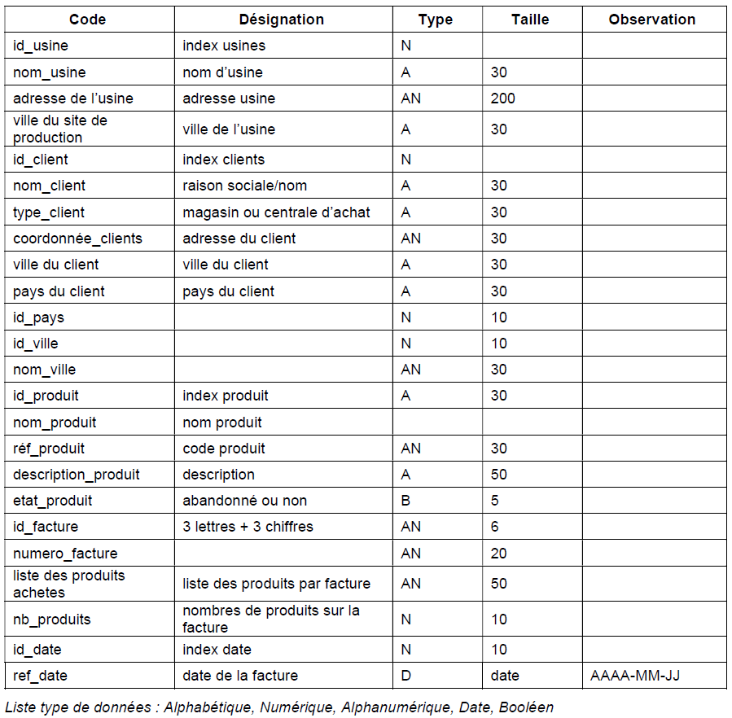
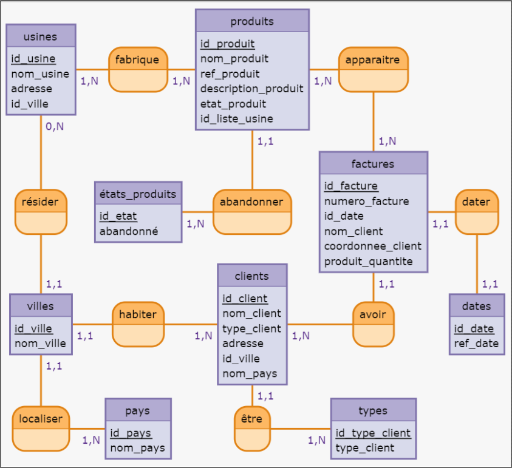
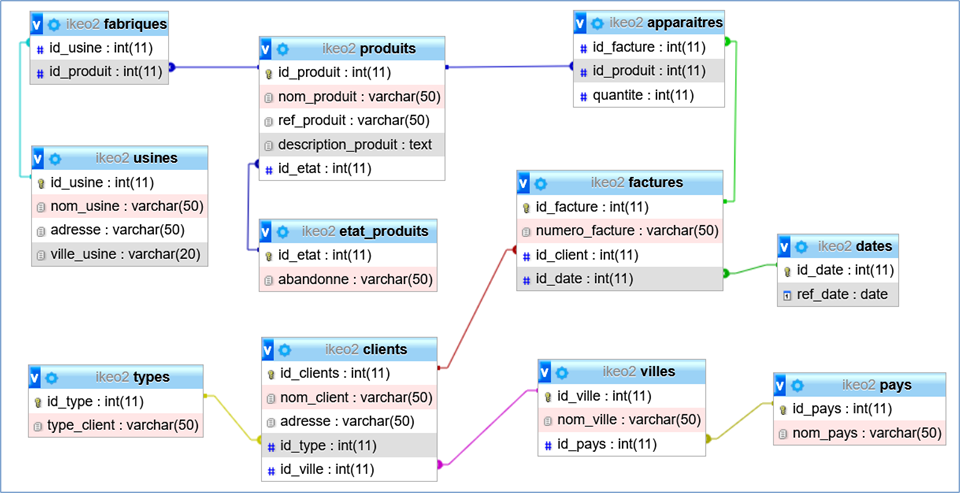
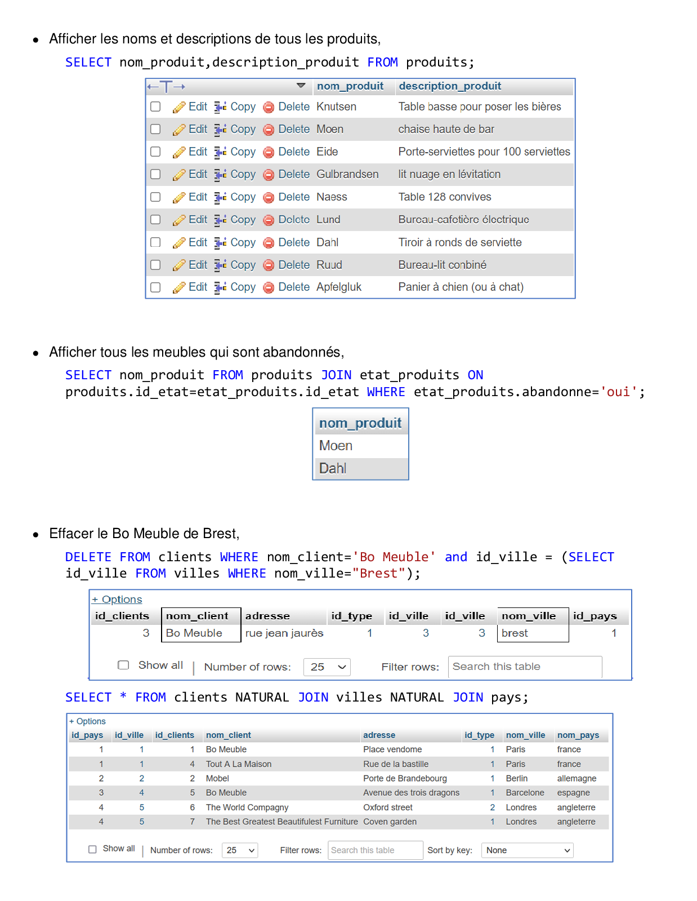
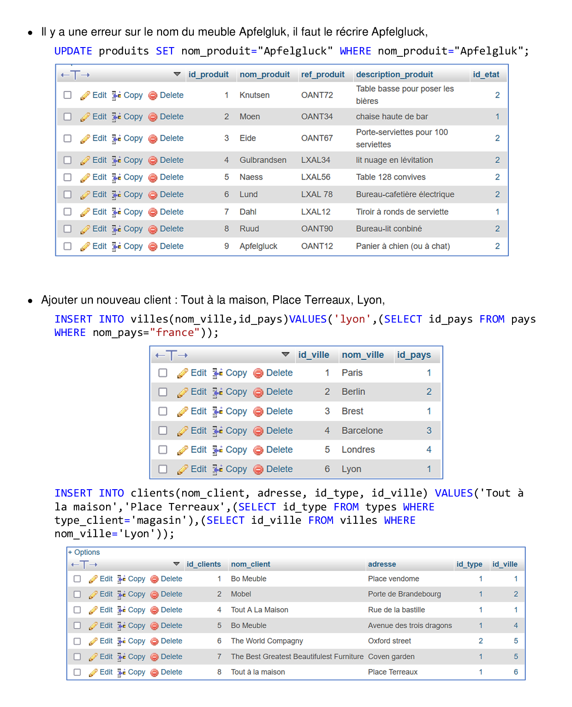
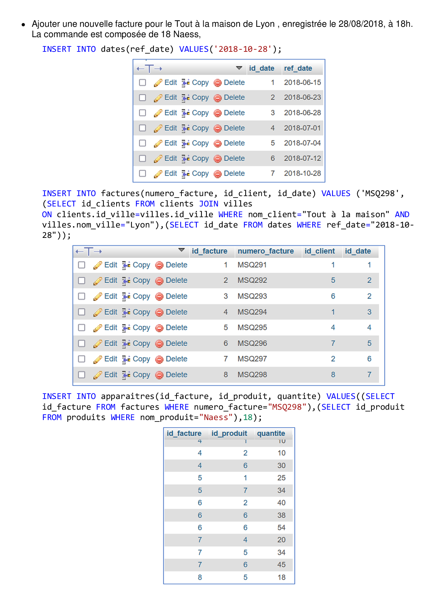
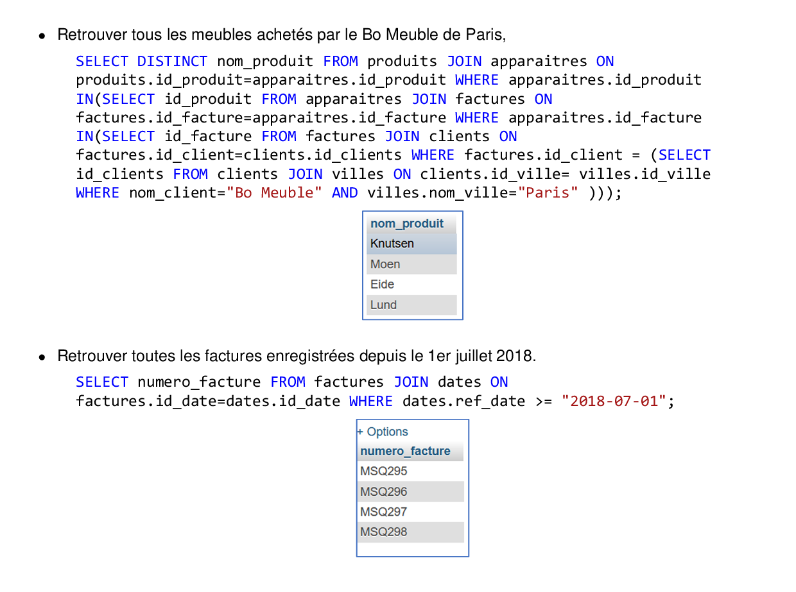

# Merise et MySQL : Gestion des Stocks IKEO avec une BDD (Brief n°4)
Les usines IKEO veulent informatiser leurs systèmes de facturations.

## 1) Dictionnaire de données 
 

## 2) Les dépendances fonctionnelles (DF) 
Après étude du dictionnaire, voici les DF trouvées :
- **Sites_production** 
Id_usine -> nom_usine, adresse, id_ville 
Id_ville -> nom_ville 
- **clients** 
Id_client -> type_client, nom_client, adresse_client, id_ville, id_pays 
id_type_client -> type_client 
Id_pays -> nom_pays 
-  **produits** 
Id_produit -> nom_produit, ref_produit, description_produit, etat_produit, id_liste_usine 
Id_liste_usine -> usine 
- **factures** 
Id_factures -> numéro_facture, date_facture, nom_client, coordonnee_client, produit_quantite 
Id_coordonnee_client -> nom_client, adresse_client, id_ville, 
Id_produit_quantite -> nom_produit, quantité 
Id_date -> date 
  
## 3) Le schéma entité-association (MCD) 
 

## 4) Le MLD 
1. 	**usines** ( *id_usine, nom_usine, adresse, nom_ville, id_ville* )
2. 	**clients** ( *id_client, nom_client, id_type_client, adresse, id_ville* )
3. 	**villes** ( *id_ville, nom_ville, id_pays* )
4. 	**pays** ( *id_pays, nom_pays* )
5. 	**type_clients** ( *id_type_client, type_client* )
6. 	**produits** ( *id_produit, nom_produit, ref_produit, description_produit, id_etat* )
7. 	**etats_produits** ( *id_etat, abandonné* )
8. 	**fabrique** ( *id_usine, id_produit* )
9. 	**factures** ( *id_facture, numero_facture, id_date, id_client, id_facture* )
10. **apparaitre** ( *id_facture, id_produit, quantité* )
11. **dates** ( *id_date, date* )
 
 

## 5) Le schéma de la base créée 
 

## 6) Les requêtes SQL 
 
 
 
 